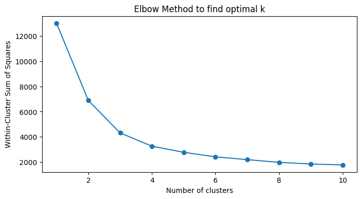
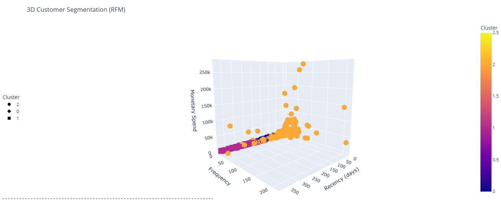

# Customer Segmentation Using RFM Analysis and K-Means Clustering

## Project Overview

This project performs customer segmentation on transactional sales data using the classic **RFM (Recency, Frequency, Monetary)** model combined with **K-Means clustering**. The goal is to identify distinct customer groups based on purchasing behavior to enable targeted marketing, personalized communication, and improved customer retention strategies.

The dataset includes transactional details such as invoice numbers, product codes and descriptions, quantities, unit prices, invoice dates, customer IDs, and countries.

---

## Dataset

The data contains the following key fields:

- **InvoiceNo:** Unique invoice number per transaction.
- **StockCode:** Product identifier.
- **Description:** Product description.
- **Quantity:** Number of units purchased.
- **InvoiceDate:** Date and time of transaction.
- **UnitPrice:** Price per unit.
- **CustomerID:** Unique identifier for each customer.
- **Country:** Customer’s country.

Canceled transactions and entries missing customer IDs are removed during preprocessing.

---

## Methodology

This project follows a structured approach combining data cleaning, feature engineering, transformation, clustering, and visualization:

- **Data Cleaning:** Canceled transactions (invoice numbers starting with 'C') and transactions with missing `CustomerID` or non-positive quantities are removed to ensure data quality.

- **Feature Engineering:** For each customer, the following metrics are calculated:  
  - *Recency*: Days since the last purchase relative to the dataset’s most recent transaction date.  
  - *Frequency*: Number of unique purchase occasions.  
  - *Monetary*: Total amount spent.

- **Data Transformation:** To handle skewed distributions, Frequency and Monetary values undergo log transformation (`log(1 + x)`). All RFM features are then standardized using z-score scaling to ensure balanced influence during clustering.

- **Clustering:**  
  - The **K-Means** algorithm partitions customers into clusters by iteratively assigning customers to the nearest cluster centroid and updating centroids to minimize the Within-Cluster Sum of Squares (WCSS).  
  - The optimal number of clusters is selected using the Elbow Method, which plots WCSS for different cluster counts and identifies the point where gains plateau.

- **Visualization:** Multiple visualizations are created to analyze and present the segments:

  1. **Histograms:** Show distributions of Recency, Frequency, and Monetary metrics, helping to understand data skewness and spread.

  2. **Radar Charts:** Profile each cluster by displaying normalized average RFM values in a circular radar plot, highlighting the behavioral differences among segments.

  3. **Interactive 3D Scatter Plot:** Visualizes customers in three-dimensional space (Recency, Frequency, Monetary) with colors representing cluster membership, allowing rotation, zooming, and detailed exploration.

---
## Visualizations

The project produces the following key visualizations to explore and present customer segments:

### 1. Distribution Histograms of RFM Metrics  
These histograms show how Recency, Frequency, and Monetary values are distributed across all customers.  
- **Recency:** Helps identify how recent most purchases are and detect inactive customers.  
- **Frequency:** Reveals how often customers make purchases, highlighting loyal vs occasional buyers.  
- **Monetary:** Displays spending patterns, distinguishing high spenders from low spenders.

:  

---
### 2. Elbow Method Plot for Optimal Number of Clusters  
This plot displays the Within-Cluster Sum of Squares (WCSS) against various numbers of clusters (k). The "elbow" point where the decrease in WCSS starts to slow indicates the optimal number of clusters to use, balancing model complexity and fit quality.

---
### 3. Customer Segments: Recency vs Frequency Scatter Plot  
This 2D scatter plot visualizes customers based on their Recency and Frequency values, colored by their assigned cluster. It helps to quickly identify clusters with frequent recent buyers, infrequent long-ago buyers, and other groupings, providing intuitive insight into segment behaviors.

### 4. Radar Charts of Cluster Profiles  
For each customer segment, a radar chart plots the normalized average Recency, Frequency, and Monetary values on a circular graph. This visually contrasts customer groups, showing which segments have higher loyalty, spending, or inactivity.

---

### 5. Interactive 3D Scatter Plot of Customer Segments  
An interactive Plotly 3D scatter plot visualizes customers in three dimensions—Recency, Frequency, and Monetary—with color-coded clusters. Users can rotate and zoom to explore clusters’ separations and overlaps, gaining deeper insight into segment characteristics.

---

## Cluster Summary Table

The following table summarizes the average Recency, Frequency, and Monetary values for each cluster, along with the number of customers in each segment:

| Cluster | Recency (Mean) | Frequency (Mean) | Monetary (Mean) | Customer Count |
|---------|----------------|------------------|-----------------|----------------|
| 0       | 53.7           | 2.0              | 612.4           | 2028           |
| 1       | 254.0          | 1.4              | 399.4           | 982            |
| 2       | 29.2           | 9.8              | 5475.7          | 1329           |

- **Cluster 0:** Customers with moderate recency and frequency, and moderate spending.  
- **Cluster 1:** Customers with high recency (less recent), low frequency, and lower spending — possibly at-risk or inactive customers.  
- **Cluster 2:** Customers with very recent purchases, very high frequency, and highest spending — highly valuable and loyal customers.

This table helps quickly understand the characteristics of each segment and supports strategic decision-making.

---

## Business Insights

The customer segmentation analysis reveals distinct groups with unique purchasing behaviors, offering actionable insights for targeted marketing and retention strategies:

- **Loyal and High-Value Customers (Cluster 2):**  
  This segment has very recent purchases, high frequency, and the highest average spending. These customers are highly engaged and valuable, making them ideal candidates for loyalty programs, personalized offers, and exclusive promotions to strengthen retention.

- **Moderate Engagement Customers (Cluster 0):**  
  Customers in this group exhibit moderate recency and frequency, with average spending levels. They represent a stable customer base with growth potential. Targeted upselling and cross-selling initiatives can encourage increased purchase frequency and higher spending.

- **At-Risk or Inactive Customers (Cluster 1):**  
  This segment shows high recency (long time since last purchase), low frequency, and lower average spending, indicating customers who may be drifting away. Proactive re-engagement campaigns, such as win-back offers or personalized outreach, can help revive these relationships before churn occurs.

By focusing marketing efforts according to these insights, businesses can optimize budget allocation, personalize communication, and ultimately maximize customer lifetime value and business growth.

---
## Tools & Libraries

- Python 3.x  
- Pandas, NumPy for data manipulation  
- Matplotlib, Seaborn for static visualizations  
- Scikit-learn for clustering and preprocessing  
- Plotly for interactive 3D visualization

